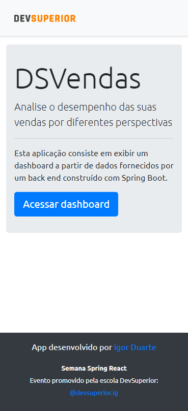
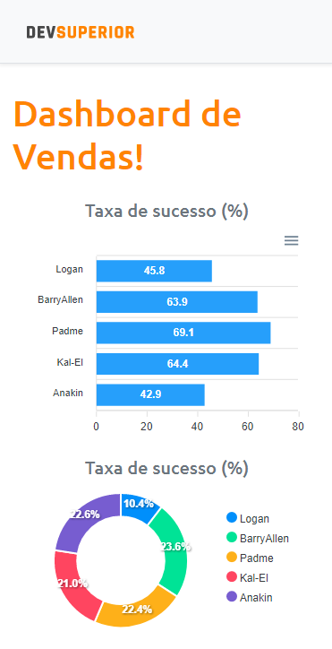
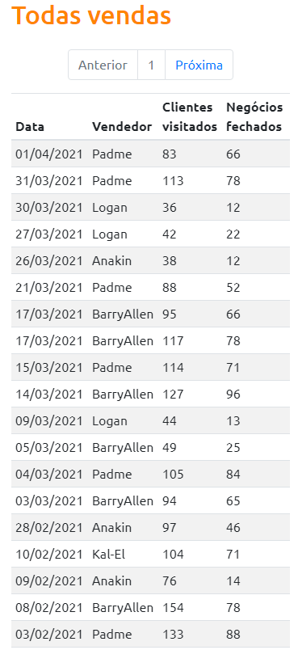
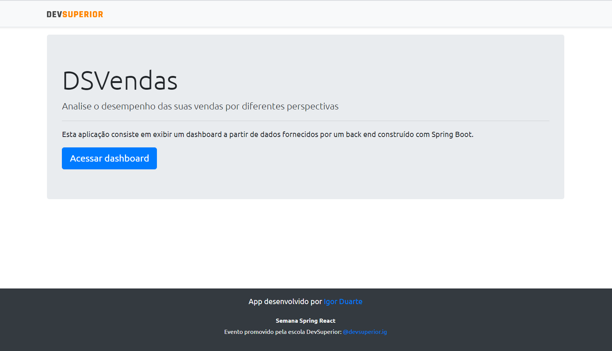

# Dashboard de vendas 
[](https://gitlab.com/Igoohd/projeto-sds3/-/blob/master/LICENSE) 

# Sobre o projeto

https://igoohd-dsvendas.netlify.app/

Dashboard de vendas é uma aplicação full stack web e mobile construída durante a 3ª edição da **Semana DevSuperior** (#sds3), evento organizado pela [DevSuperior](https://devsuperior.com "Site da DevSuperior").

A aplicação consiste em um dashboard de vendas que coleta dados de vendedores em relação ao seu fluxo de trabalho, e depois exibe no app web, que também apresenta gráficos baseados nestes dados.

## Layout mobile
  

## Layout web



## Modelo conceitual


# Tecnologias
## Back end
- Java
- Spring Boot
- Spring Data JPA
- Spring Security
- Maven
## Front end
- JavaScript
- ReactJS
- TypeScript
- HTML
- CSS
- Bootstrap
- Apex Charts
## Deploy
- Back-end: Heroku
- Front-end web: Netlify
- Banco de dados: Postgresql 12

# Como começar

## Back end
Pré-requisitos: Java 11

```bash
# Clone o repositório
$ git clone https://gitlab.com/Igoohd/projeto-sds3

# Entre na pasta back-end do projeto
$ cd backend

# Inicie o projeto
$ ./mvnw spring-boot:run
```

## Front end web
Pré-requisitos: npm / yarn

```bash
# Clone o repositório
$ git clone https://gitlab.com/Igoohd/projeto-sds3

# Entre na pasta front-end do projeto
$ cd frontend

# Instale as dependências
$ yarn install

# Inicie o projeto
$ yarn start

# Acesse o localhost
http://localhost:3000
```

# Autor

Igor Duarte de Matos Madureira

https://www.linkedin.com/in/igorduartematos/
